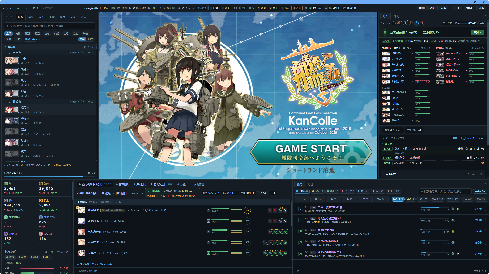

# kuma

《舰队 Collection》的信息工作台

Windows 10 / 11 的 64 位便携版，免安装

## 这是什么

kuma 只读取游戏自己产生的通信，你的记录存在自己电脑上的 `%APPDATA%\kuma`

## 下载与启动

最新的压缩包在 [Releases](https://github.com/zhangkanbbc-code/kuma/releases) 页

1. 下载压缩包，右键「属性」，有「解除锁定」就勾上
2. 把整个文件夹解压出来，不要只拖 `kuma.exe`
3. 双击 `kuma.exe`

kuma 没买代码签名证书，Windows 首次可能弹「已保护你的电脑」，点「更多信息」→「仍要运行」

游戏只接受来自日本的访问，所以还要在「设置 → 代理」里填你已有的代理工具。
岛风GO 选 HTTP、`127.0.0.1:8099`；Clash 这类选 SOCKS5

完整的安装、代理、常见问题写在压缩包里的《使用说明.md》

## 它会连哪些地方

| 目的地 | 什么时候 | 能不能关 |
|---|---|---|
| 游戏页面与游戏资源服务器 | 打开游戏；缓存里没有的立绘和语音 | 「设置 → 未缓存的立绘/语音从游戏资源服务器取」 |
| 你自己填的推送地址 | 开了手机推送，且通知规则命中 | 默认就是关的 |
| 其他任何第三方 | 不连 | — |

## 数据来源与许可

kuma 显示的社区资料来自舰娘百科、KC3Kai、poi 等项目。逐项出处与许可集中在两处：

- 压缩包里的 `NOTICE.md`
- 应用内「设置 → 资料来源与许可」

`LICENSE` 那份 MIT 只管代码。随包的资料与美术不在它的范围里，各按各自的许可，逐项写在 `NOTICE.md`

其中一部分按「非商业性使用」授权，所以 kuma 永久免费，也不得用于任何商业用途

kuma 与《艦隊これくしょん -艦これ-》的运营方无关，也未获其授权或认可

## 设置里值得先看一眼的几项

| 在哪 | 做什么 |
|---|---|
| 代理 | 连上游戏的必填项，保存即时生效 |
| 未缓存的立绘/语音从游戏资源服务器取 | 关掉之后只读本机缓存，图鉴会多几个空格 |
| 手机推送 | 默认关。打开后要自己填服务器和频道 |
| 记录保留与清理 | 默认一直留着。想按月清或设保留天数在这里 |
| 语音档案 / 立绘档案 | 你在游戏里听过、见过的东西存在这里，过季之后还看得到 |
| 缓存修复 | 游戏白屏或贴图错乱时用，档案和记录都保留 |
| 完整备份与恢复 | 换电脑或重装前先来这里 |
| 社区上报 | 尚未接入，挂牌禁用 |

## 遇到问题

先看压缩包里的《使用说明.md》，常见问题和已知限制都在那儿

那里没有的，两个地方都能说：

- [GitHub Issues](https://github.com/zhangkanbbc-code/kuma/issues)
- 贴吧发布贴的反馈楼（链接见发布贴）

想看代码或者自己构建，见 [开发指南](docs/开发指南.md)
